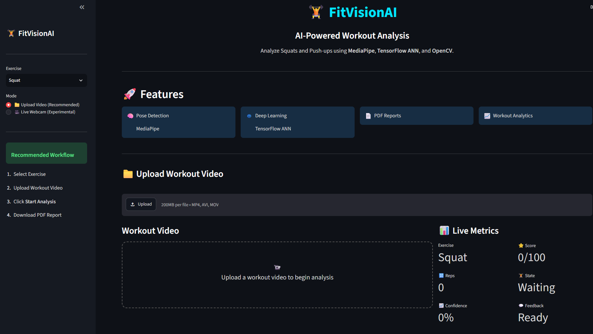
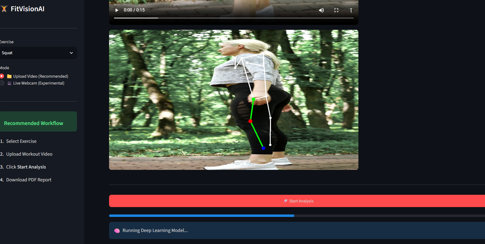
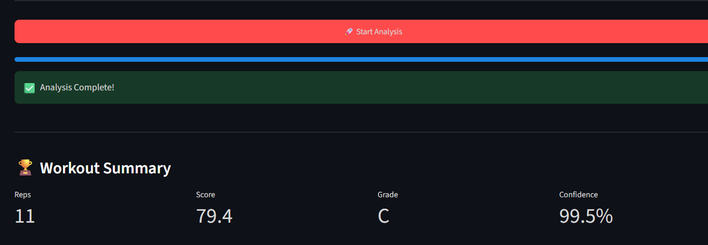
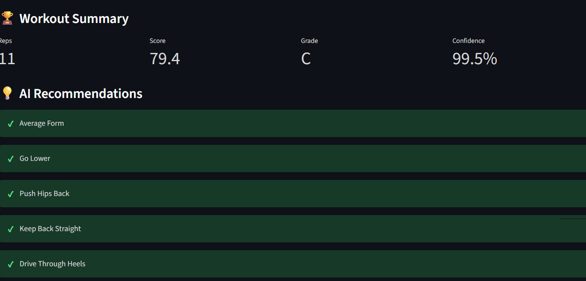
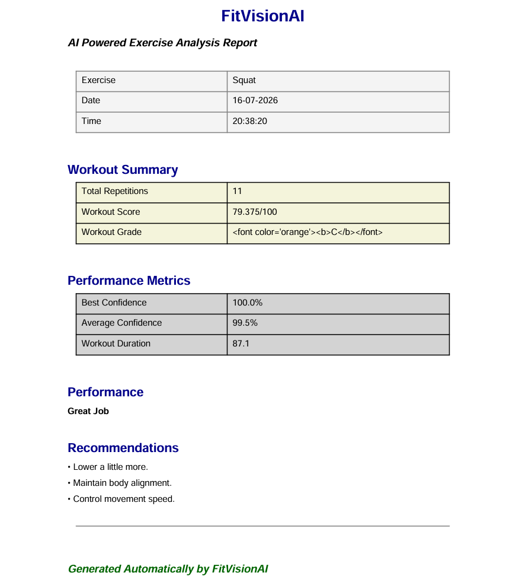
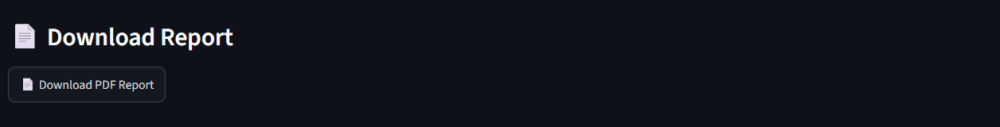
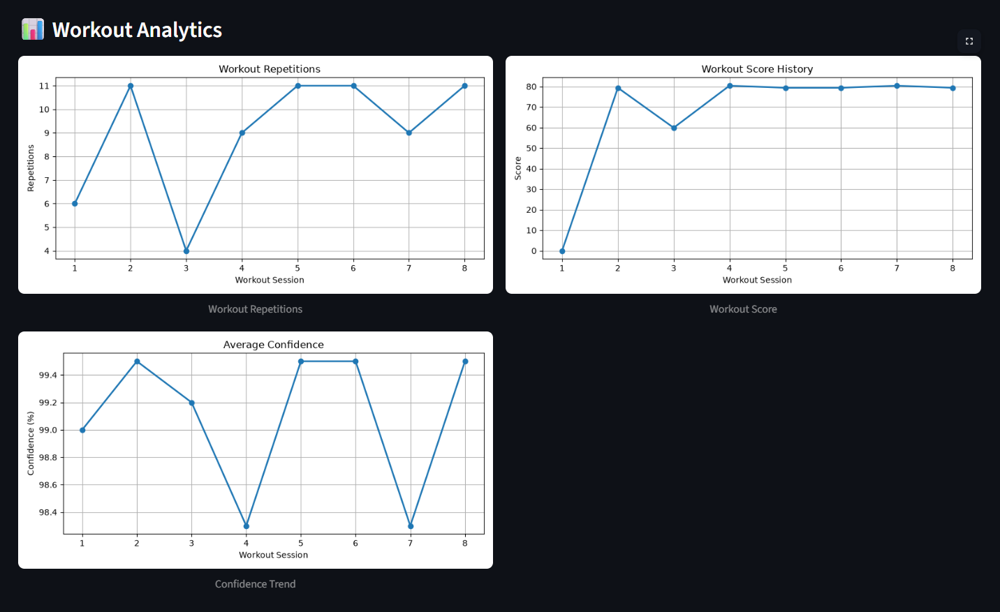
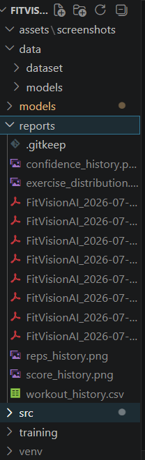

# 🏋️ FitVisionAI

<p align="center">


</p>

---

# 📌 Overview

FitVisionAI is an AI-powered fitness analysis system that automatically detects workout posture, classifies exercise stages, counts repetitions, evaluates form, generates workout reports, and visualizes workout analytics.

The project combines **Computer Vision**, **Deep Learning**, and **Pose Estimation** to create an intelligent virtual fitness coach capable of analyzing exercises from recorded videos.

---

# ✨ Features

- 🧠 ANN-based Exercise Classification
- 🎯 MediaPipe Pose Estimation
- 📐 Joint Angle Calculation
- 🔢 Automatic Rep Counting
- 📊 Live Confidence Score
- 💪 Real-time Form Feedback
- ⭐ Workout Performance Score
- 📄 PDF Workout Report Generation
- 📈 Workout History Tracking
- 📉 Analytics Dashboard
- 🏋️ Squat Detection
- 🤸 Push-up Detection

---

# 📸 Screenshots

## Home Screen



---

## Live Analysis



---

## Workout Summary



---

## Recommendations



---

## PDF Report



---

## Download Report



---

## Analytics Dashboard



---

## Generated Reports




# 🏗️ Project Architecture

```
                Input Video / Webcam
                         │
                         ▼
                 Video Reader (OpenCV)
                         │
                         ▼
              MediaPipe Pose Estimation
                         │
                         ▼
               Pose Landmark Extraction
                         │
        ┌────────────────┴────────────────┐
        ▼                                 ▼
 Joint Angle Calculator            ANN Classifier
        │                                 │
        └──────────────┬──────────────────┘
                       ▼
               Exercise State Prediction
                       ▼
                Repetition Counter
                       ▼
                Posture Evaluation
                       ▼
              Workout Feedback System
                       ▼
         PDF Report + Workout Analytics
```

---

# 📊 Model Performance

| Exercise | Model | Accuracy |
|-----------|-------|---------:|
| Squat | Artificial Neural Network (ANN) | **99.0%** |
| Push-up | Artificial Neural Network (ANN) | **100.0%** |

---

## Push-up Classification Report

| Metric | DOWN | UP |
|--------|------|----|
| Precision | **1.00** | **1.00** |
| Recall | **1.00** | **1.00** |
| F1-Score | **1.00** | **1.00** |

**Overall Accuracy:** **100%**

Confusion Matrix

```
[[179   0]
 [  0 172]]
```

---

# 🛠️ Tech Stack

## Programming

- Python

## Computer Vision

- OpenCV
- MediaPipe

## Deep Learning

- TensorFlow
- Keras

## Machine Learning

- Scikit-learn
- Joblib

## Data Processing

- NumPy
- Pandas

## Visualization

- Matplotlib

## Report Generation

- ReportLab

---

# 📂 Folder Structure

```
FitVisionAI
│
├── app.py
├── train_model.py
├── train_pushup_model.py
│
├── src
│   ├── pose_detector.py
│   ├── angle_calculator.py
│   ├── model_predictor.py
│   ├── posture_checker.py
│   ├── squat_counter.py
│   ├── pushup_counter.py
│   ├── feedback_generator.py
│   ├── report_generator.py
│   ├── workout_history.py
│   ├── workout_analytics.py
│   ├── video_reader.py
│   └── ui.py
│
├── models
├── data
├── reports
├── assets
│   └── screenshots
│
├── requirements.txt
└── README.md
```

---

# 🚀 Installation

```bash
git clone https://github.com/YOUR_USERNAME/FitVisionAI.git

cd FitVisionAI

python -m venv venv

# Windows

venv\Scripts\activate

pip install -r requirements.txt
```

---

# ▶️ Run

```bash
python app.py
```

---

# 🌐 Live Demo

[🚀 Launch FitVisionAI](https://fitvisionai-cakwshqjbu7btjktuycqrv.streamlit.app/)

---

# ⚠️ Deployment Note

FitVisionAI is optimized for local execution. Due to resource and rendering limitations of Streamlit Community Cloud, continuous frame-by-frame video playback may not display as smoothly as it does locally. However, the core functionalities—including pose estimation, exercise classification, repetition counting, posture analysis, workout analytics, and PDF report generation—remain fully functional.

For the best experience, run the application locally.

# 📋 Workflow

```
Video Input
      │
      ▼
Pose Detection
      │
      ▼
Landmark Extraction
      │
      ▼
Angle Calculation
      │
      ▼
ANN Exercise Classification
      │
      ▼
Rep Counter
      │
      ▼
Posture Checker
      │
      ▼
Feedback Generator
      │
      ▼
Workout Analytics
      │
      ▼
PDF Report
```

---

# 🚀 Future Improvements

- 🎥 Real-time webcam workout tracking
- 🧠 LSTM / GRU based temporal exercise recognition
- 🏃 Additional exercises (Lunges, Burpees, Planks, Jumping Jacks)
- 📱 Mobile application deployment
- ☁️ Cloud workout history synchronization
- 🎙️ Voice-guided workout assistant
- 🤖 Personalized AI workout recommendations
- ⚠️ Injury risk prediction using biomechanics

---

# 👩‍💻 Author

**Niyati Singh**

B.Tech Artificial Intelligence & Data Science

Passionate about Artificial Intelligence, Computer Vision, Deep Learning and Data Science.

---

# ⭐ If you like this project

Please consider giving this repository a ⭐ on GitHub.
